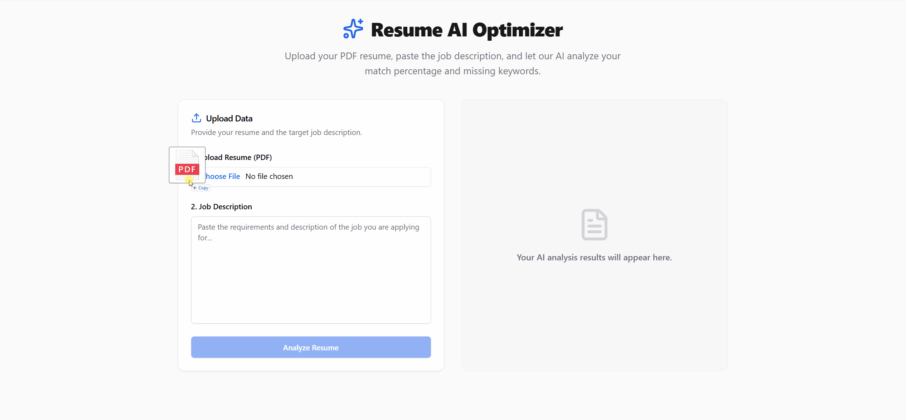

# 🚀 Resume AI Optimizer


A Full-Stack web application built with Java 21 and React that **analyzes and optimizes resumes against job descriptions using AI**. By leveraging a local LLM via Ollama and Spring AI, the application ensures 100% data privacy while providing actionable feedback to help candidates pass Applicant Tracking Systems (ATS).

This project is ideal for:
- **Job Seekers** → optimizing their resumes to match specific job requirements.
- **Career Coaches** → scaling their resume review process with AI-driven insights.

---

## ✨ Features

- ✅ **AI-Powered Analysis:** Calculates match percentage and extracts missing keywords.
- ✅ **Actionable Feedback:** Generates custom improvement tips based on industry standards.
- ✅ **100% Privacy:** Uses a local LLM (Ollama), meaning your personal PDF data never leaves your machine.
- ✅ **Modern UI:** Built with React, Vite, Tailwind CSS, and Shadcn/ui for a seamless user experience.
- ✅ **Containerized Infrastructure:** Fully dockerized with multi-stage builds for easy deployment.

---

## 📸 Visual Demo



---

## 📑 Table of Contents

- [Features](#-features)
- [Visual Demo](#-visual-demo)
- [Installation](#-installation)
- [Usage](#-usage)
- [Technologies Used](#-technologies-used)
- [Project Structure](#-project-structure)
- [Contributing](#-contributing)
- [License](#-license)

---

## ⚙️ Installation

The easiest way to run this project is using Docker. Follow these steps to set up the environment.

### 1. Requirements
- [Docker & Docker Compose](https://www.docker.com/products/docker-desktop/)
- [Ollama](https://ollama.com/) (Must be installed on your host machine to run the local LLM)

### 2. External Dependency: Ollama & AI Model

This project relies on a local LLM to process the data without sending your resume to the cloud.

1. **Install Ollama:** Download and install it from the official website.
2. **Pull the Model:** Open your terminal and download the required AI model (e.g., Llama 3.2). Keep the Ollama server running.
    ```bash
    ollama run llama3.2
    ```
Note: The first run will download the model, which may take a few minutes depending on your internet connection.

### 3. Setup Steps

```bash
# 1. Clone the repository
git clone [https://github.com/MatheusBarbosaSE/resume-ai-optimizer.git](https://github.com/MatheusBarbosaSE/resume-ai-optimizer.git)
cd resume-ai-optimizer

# 2. Start the application using Docker Compose
docker compose up --build -d
```

The -d flag runs the containers in detached mode. The initial build might take a few minutes as it downloads Java, Node.js, and compiles the application.


---

## 💻 Usage
After the Docker containers are up and running:

1. Open your web browser and navigate to: http://localhost:5173

2. Upload your Resume in PDF format (Max size: 5MB).

3. Paste the Job Description of the role you are applying for in the text area.

4. Click "Analyze Resume".

5. Wait a few moments while the local AI processes the data.

6. Review your Match Percentage, Missing Keywords, and AI Improvement Tips directly on the dashboard.

To stop the application, run:

```bash
docker compose down
```

---

## 🛠 Technologies Used

- **Backend & Logic**
  - [Java 21](https://jdk.java.net/21/)
  - [Spring Boot 3](https://spring.io/projects/spring-boot): The core framework for building the robust REST API.
  - [Spring AI](https://spring.io/projects/spring-ai): For seamless integration with local Large Language Models.
  - [Apache PDFBox](https://pdfbox.apache.org/): For parsing and extracting text from the uploaded PDF resumes.
- **Frontend (UI)**
  - [React 18](https://react.dev/) & [Vite](https://vitejs.dev/): For a fast, modern, and component-based user interface.
  - [TypeScript](https://www.typescriptlang.org/): For type-safe front-end development and catching errors early.
  - [Tailwind CSS](https://tailwindcss.com/) & [Shadcn/ui](https://ui.shadcn.com/): For accessible, highly customizable styling and components.
  - [Axios](https://axios-http.com/): For handling asynchronous HTTP requests to the backend API.
- **Infrastructure & External Dependencies**
  - [Docker & Docker Compose](https://www.docker.com/): For containerizing the application using multi-stage builds and orchestrating services.
  - [Ollama](https://ollama.com/): The core engine for running the local LLM (Llama 3.2) securely on the host machine without relying on external cloud APIs.

---

## 📂 Project Structure

```bash
resume-ai-optimizer/
│
├── demo/                         # Media used in README
├── resume-ai-optimizer-ui/       # React Frontend Application
│   ├── src/                      # UI Source code (Components, Services, App.tsx)
│   ├── package.json              # Node dependencies
│   ├── tailwind.config.js        # Tailwind CSS configuration
│   ├── vite.config.ts            # Vite bundler configuration
│   └── Dockerfile                # Frontend multi-stage build configuration (Nginx)
│
├── src/                          # Spring Boot Backend Source Code
│   ├── main/java/.../            # Controllers, Services, and DTOs
│   ├── main/resources/           # application.properties (CORS & Ollama configs)
│   └── test/java/.../            # Backend unit and integration tests
│
├── .gitignore                    # Ignore rules for Git
├── docker-compose.yml            # Orchestrates Backend and Frontend containers
├── Dockerfile                    # Backend multi-stage build configuration (JDK 21)
├── LICENSE                       # MIT license
├── pom.xml                       # Maven dependencies 
└── README.md                     # Project documentation
```

---

## 🤝 Contributing

1. Fork the repository
2. Create a feature branch (`git checkout -b feature/new-feature`)
3. Commit your changes (`git commit -m 'feat: add new feature'`)
4. Push to the branch (`git push origin feature/new-feature`)
5. Open a Pull Request

Feel free to open **issues** for bug reports or suggestions.

---

## 📄 License

This project is licensed under the **[MIT License](LICENSE)**.  
You are free to use, copy, modify, and distribute this software, provided you keep the original credits.
